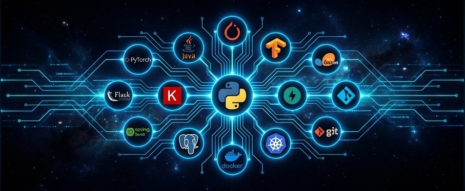

<h1 align="center">Hi 👋, I'm Arinjay Sarkar</h1>
<h3 align="center">Aspiring AI & Software Engineer | Data Science Undergrad</h3>

  

-----

&nbsp;
&nbsp;

### 👨🏻‍💻 &nbsp;About Me

💡 &nbsp; [cite_start]I am an aspiring AI & Software Engineer with a rigorous dual-degree in Engineering and Data Science from Jadavpur University and IIT Madras[cite: 6, 19, 22].

[cite_start]🌱 &nbsp;I have hands-on experience in developing, training, and deploying deep learning models (CNNs, YOLO) for Computer Vision and NLP[cite: 7].\
[cite_start]✍️ &nbsp;I possess proven ability to build full-stack web applications and manage complex database schemas[cite: 8].\
[cite_start]💬 &nbsp;I am seeking to leverage my skills in machine learning and backend development to contribute to innovative AI solutions[cite: 9].

-----
### 📫 &nbsp; How to reach me:

 &nbsp;
 &nbsp;
&nbsp;

-----

<h1 align="center">Selected Projects</h1>

 

### Languages and Tools

  
  &nbsp;
  
  &nbsp;
  
  &nbsp;
  
  &nbsp;
  
    
  
  &nbsp;
  
  &nbsp;
  
  &nbsp;
  
  &nbsp;
  
  &nbsp;
  
    
  
  &nbsp;
  
  &nbsp;
  
  &nbsp;
  
  &nbsp;
  
  &nbsp;
  
    
  
  &nbsp;
  
  &nbsp;
  

-----

<h1 align="center">Github Stats</h1>

  

 

  
  

 
