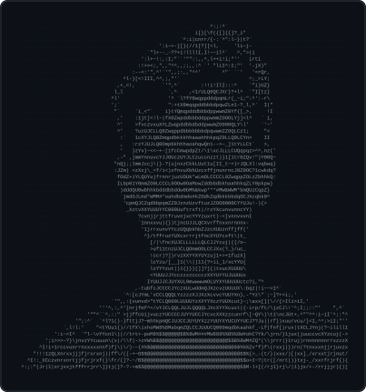
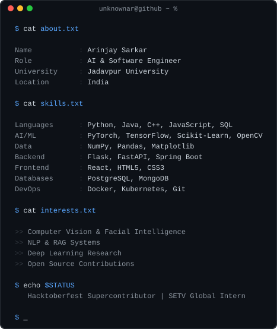

<table>
  <tr>
    <td valign="top" width="50%">
      
    </td>
    <td valign="top" width="50%">
      
    </td>
  </tr>
</table>

-----

&nbsp;
&nbsp;

-----

### 📫 &nbsp; Connect with me

 &nbsp;
 &nbsp;
&nbsp;

-----

<h1 align="center">Selected Projects</h1>

<table width="100%">
  <tr>
    <td align="center" valign="top" width="33%">
      
       
      <b>🏥 Patient & Doctor Mgmt System</b>
    </td>
    <td align="center" valign="top" width="33%">
      
       
      <b>📊 Equity Research AI Tool</b>
    </td>
    <td align="center" valign="top" width="33%">
      
       
      <b>🛒 AI Q&A System</b>
    </td>
  </tr>
  <tr>
    <td align="center" valign="top" width="33%">
      
       
      <b>🤖 AI-Powered Quiz Gen</b>
    </td>
    <td align="center" valign="top" width="33%">
      
       
      <b>❌⭕ Advanced TicTacToe</b>
    </td>
    <td align="center" valign="top" width="33%">
      
       
      <b>🐦 Android Game Clone</b>
    </td>
  </tr>
</table>

-----

<h1 align="center">Github Stats</h1>

  

 

  
  

 
